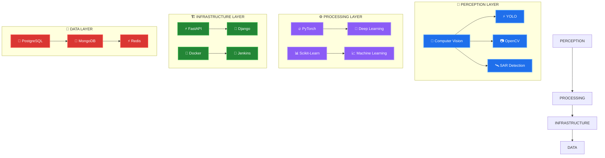

<!-- ╔══════════════════════════════════════════════════════════════════╗ -->
<!-- ║  README.md — K DHYANA SAMAGA — THE ARCHITECT'S PROFILE         ║ -->
<!-- ║  Built from scratch. Trend-setting. One of a kind.             ║ -->
<!-- ╚══════════════════════════════════════════════════════════════════╝ -->

<div align="center">

<!-- ═══════════════════ HERO SECTION ═══════════════════ -->


<br/>

<!-- Animated typing with monospace terminal feel -->
[](https://git.io/typing-svg)

<!-- Status badges — clean, minimal, informative -->
<p>
  <a href="https://github.com/kdhyanasamaga"></a>
  <a href="mailto:kdhyanasamaga@gmail.com"></a>
  <a href="https://komarev.com/ghpvc/?username=kdhyanasamaga"></a>
</p>

<!-- Trophies — dark, borderless -->
<a href="https://github.com/ryo-ma/github-profile-trophy">
  
</a>

</div>

<!-- ═══════════════════ SYSTEM IDENTITY ═══════════════════ -->

<br/>

<table>
<tr><td valign="top" width="55%">

## `> cat /etc/architect.conf`

```yaml
# ════════════════════════════════════
#  SYSTEM IDENTITY — K DHYANA SAMAGA
# ════════════════════════════════════

name: "K Dhyana Samaga"
role: "AI/ML Engineer & Vision Architect"
location: "Udupi, Karnataka 🇮🇳"
education:
  degree: "B.E. in AI & Machine Learning"
  institute: "Srinivas Institute of Technology"
  cgpa: 7.89
  progress: "████████████████████░░░░ 75%"

current_focus:
  - real_time_computer_vision
  - distributed_backend_systems
  - intelligent_automation

philosophy: >
  "Write code that machines respect 
   and engineers admire."
```

</td><td valign="top" width="45%">

## `> systemctl status achievements`

```log
● achievements.service — LOADED & ACTIVE
  
  [2024] 🏆 1st Place
         Inter-Dept Coding Competition
  
  [2024] 👑 Team Lead
         24-Hour Hackathon
  
  [2024] 📄 Research Published
         Ship Detection in SAR Images
  
  [2025] 📋 Documentation Lead
         SSOSC Open Source Community
  
  [2025] 🎯 Event Coordinator
         AIML Department

  Active: active (running) since 2022
  Memory: ∞
  Tasks:  unlimited
```

</td></tr>
</table>

<!-- ═══════════════════ EXPERIENCE TIMELINE ═══════════════════ -->

<br/>

<div align="center">

## `> git log --oneline --graph`

```
* 2024-2025 ─── Thaniya Technologies ─── Technical Trainer (400+ students impacted)
│
* 2024      ─── Research Publication  ─── Ship Detection in SAR Images (Published)
│
* 2022-2026 ─── B.E. in AI & ML      ─── Srinivas Institute of Technology (7.89 CGPA)
```


<br/>
<sub><b>DEGREE COMPLETION — 75% ████████████████████░░░░░</b></sub>

</div>

<!-- ═══════════════════ KERNEL MANIFEST ═══════════════════ -->

<br/>

<div align="center">

## `> hexdump -C /dev/brain`

</div>

```c
/* ═══════════════════════════════════════════════════════════
 *  kernel_architect.h — The Core Identity Module
 *  Author: K Dhyana Samaga
 *  License: MIT (Mind · Intelligence · Tenacity)
 * ═══════════════════════════════════════════════════════════ */

#pragma once

#define ARCHITECT    "K_DHYANA_SAMAGA"
#define VERSION      "3.5.0-stable"
#define STACK_DEPTH  INFINITY

typedef enum {
    PYTHON, JAVA, C,
    FASTAPI, DJANGO, DOCKER,
    PYTORCH, OPENCV, YOLO,
    REDIS, MONGODB, POSTGRESQL
} TechStack;

typedef struct {
    const char*   name;
    const char*   archetype;
    TechStack     arsenal[12];
    unsigned long compute_cycles;
    _Bool         accepting_challenges;
} Architect;

static const Architect SAMAGA = {
    .name                = "K Dhyana Samaga",
    .archetype           = "Vision Kernel Engineer",
    .arsenal             = { PYTHON, PYTORCH, FASTAPI, OPENCV,
                             YOLO, REDIS, MONGODB, DOCKER,
                             DJANGO, JAVA, C, POSTGRESQL },
    .compute_cycles      = 0xFFFFFFFFFFFFFFFF,
    .accepting_challenges = 1
};
```

<!-- ═══════════════════ NEURAL ARCHITECTURE ═══════════════════ -->

<br/>

<div align="center">

## `> cat /proc/neural_topology`



<br/>

<!-- Skill icons — clean grid -->


</div>

<!-- ═══════════════════ GITHUB METRICS ═══════════════════ -->

<br/>

<div align="center">

## `> htop --sort-key=COMMITS`

<!-- Profile Summary Card — full width -->


<br/>

<!-- Stats row -->


<br/>

<!-- Activity graph — full width -->


<br/>

<!-- Contribution snake — the viral element -->
<picture>
  <source media="(prefers-color-scheme: dark)" srcset="https://raw.githubusercontent.com/kdhyanasamaga/kdhyanasamaga/output/github-snake-dark.svg" />
  <source media="(prefers-color-scheme: light)" srcset="https://raw.githubusercontent.com/kdhyanasamaga/kdhyanasamaga/output/github-snake.svg" />
  
</picture>

</div>

<!-- ═══════════════════ LIVE FEEDS ═══════════════════ -->

<br/>

<div align="center">

## `> tail -f /var/log/performance.log`

<table>
<tr>
<td align="center" width="50%">

**🏆 LeetCode Status**

[](https://leetcode.com/u/kdhyanasamaga/)

</td>
<td align="center" width="50%">

**📝 Latest from Medium**

<a href="https://medium.com/@kdhyanasamaga">
  
</a>

</td>
</tr>
</table>

</div>

<!-- ═══════════════════ CERTIFICATIONS ═══════════════════ -->

<br/>

<div align="center">

## `> ls /etc/certificates/`

<p>
  
  
  
  
</p>

</div>

<!-- ═══════════════════ CONNECT ═══════════════════ -->

<br/>

<div align="center">

## `> ssh root@connect`

<p>
  <a href="https://linkedin.com/in/kdhyanasamaga"></a>
  <a href="https://github.com/kdhyanasamaga"></a>
  <a href="https://leetcode.com/u/kdhyanasamaga/"></a>
  <a href="https://medium.com/@kdhyanasamaga"></a>
  <a href="mailto:kdhyanasamaga@gmail.com"></a>
  <a href="https://kdhyanasamaga.github.io"></a>
</p>

<br/>

<!-- Spotify — live soundtrack -->
<a href="https://open.spotify.com/user/kdhyanasamaga">
  
</a>

</div>

<!-- ═══════════════════ FOOTER ═══════════════════ -->

<br/>

<div align="center">


```
╔═══════════════════════════════════════════════════════════╗
║  "First, solve the problem. Then, write the code."       ║
║                                    — John Johnson        ║
╚═══════════════════════════════════════════════════════════╝
```

<sub>
  
  
</sub>

</div>
