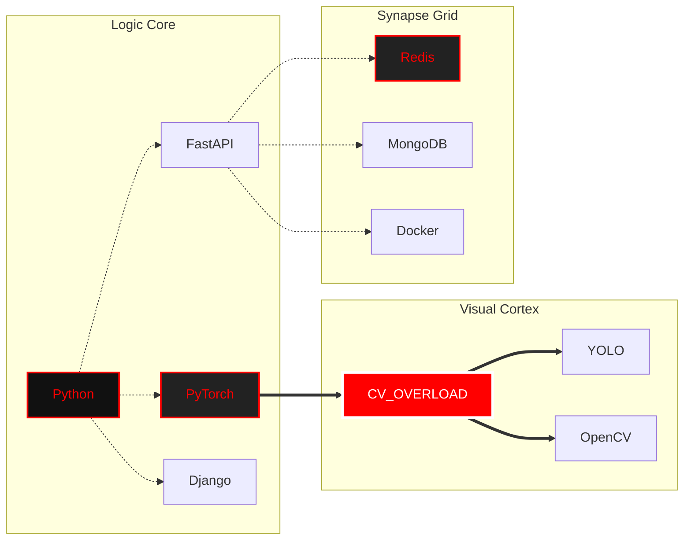

<div align="center">


# ⚠️ BREACH DETECTED: K DHYANA SAMAGA
### AI CORE | COMPUTER VISION | DISTRIBUTED SYSTEMS

<p align="center">
  
  
  
</p>

<p align="center">
  
</p>

<p align="center">
  <a href="https://github.com/ryo-ma/github-profile-trophy">
    
  </a>
</p>

<div align="center">

[](https://git.io/typing-svg)

</div>

</div>

---

```text
 █████╗ ███╗   ██╗██╗████████╗██╗ ██████╗ 
██╔══██╗████╗  ██║██║╚══██╔══╝██║██╔════╝ 
███████║██╔██╗ ██║██║   ██║   ██║██║  ███╗
██╔══██║██║╚██╗██║██║   ██║   ██║██║   ██║
██║  ██║██║ ╚████║██║   ██║   ██║╚██████╔╝
╚═╝  ╚═╝╚═╝  ╚═══╝╚═╝   ╚═╝   ╚═╝ ╚═════╝ 
```

## 📝 Professional Summary

> AI and Machine Learning Engineering student with hands-on experience in building **real-time computer vision**, **distributed backends**, and **intelligent automation** systems. Proficient in Python, FastAPI, and database technologies like MongoDB and Redis. Experienced in object detection, geospatial indexing, and edge AI deployment. Passionate about solving real-world challenges through scalable and reliable AI solutions.

### 🔭 My Journey So Far...

| Timeframe | Milestone | Achievement |
| :--- | :--- | :--- |
| **2024 - 2025** | **Thaniya Technologies** | *Technical Trainer* - Impacted 400+ students in coding & aptitude. |
| **2022 - 2026** | **B.E. in AI & ML** | *Srinivas Institute of Technology* - **7.89 CGPA** |

**Degree Progress \[Year 3/4\]**

| **2024** | **Research Publication** | Published paper on **Ship Detection in SAR Images**. |

<br/>

### ⛓️ System_Manifest.json
```json
{
  "subject_id": "K_DHYANA_SAMAGA",
  "archetype": "Neural Network Architect",
  "system_integrity": "COMPROMISED",
  "breach_protocol": "ACTIVE",
  "philosophy": "Destroy limitations. Code for absolute scale.",
  "access_level": "S-CLASS",
  "volatile_modules": [
    "distributed_reconnaissance",
    "real_time_detection_overload"
  ]
}
```

## 🛠️ Neural Overloadexpertise_flow.map

<div align="center">




</div>


## 📊 GitHub Contribution Details

<div align="center">
  
</div>

<br/>

<div align="center">
  
  
  
</div>


## 🚀 Live Performance & Blog

<div align="center">

| 🏆 LeetCode Statistics | 📝 Latest Articles |
| :--- | :--- |
| [](https://leetcode.com/u/kdhyanasamaga/) | <a href="https://medium.com/@kdhyanasamaga"></a> |

</div>


## 🏆 Certifications & Badges

<div align="center">

| | | | |
| :---: | :---: | :---: | :---: |
|  |  |  |  |

</div>


## 🎖️ Key Achievements

- 🥇 **1st Place** — Inter-Department Coding Competition (2024)
- 👑 **Team Lead** — 24-Hour Hackathon (2024)
- 📋 **Documentation Lead** — SSOSC (2025)
- 🎯 **Event Coordinator** — AIML Department (2024)
- 📄 **Research Paper** — Published "Ship Detection in SAR Images" (2024)


## 🤝 Let's Connect!

<div align="center">

| | | |
| :---: | :---: | :---: |
| [](https://linkedin.com/in/kdhyanasamaga) | [](https://github.com/kdhyanasamaga) | [](https://leetcode.com/u/kdhyanasamaga/) |
| [](https://medium.com/@kdhyanasamaga) | [](mailto:kdhyanasamaga@gmail.com) | [](https://kdhyanasamaga.github.io) |

</div>

<div align="center">
  <a href="https://open.spotify.com/user/kdhyanasamaga">
    
  </a>
</div>

<br/>

<div align="center">


*"First, solve the problem. Then, write the code."*


</div>
