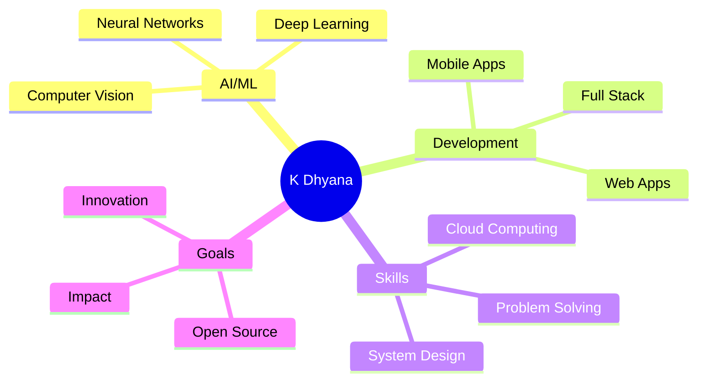

# 👋 Hi, I'm K Dhyana Samaga

<div align="center">
  
</div>

<div align="center">
  
</div>

<div align="center">
  
  
</div>

---

## 🚀 About Me

```python
class KDhyanaSamaga:
    def __init__(self):
        self.name = "K Dhyana Samaga"
        self.role = "AI/ML Engineer & Full Stack Developer"
        self.education = "B.E. in AIML Engineering"
        self.location = "Karnataka, India"
        self.languages = ["Python", "Java", "C", "JavaScript"]
        self.current_focus = ["Computer Vision", "Deep Learning", "Full Stack Development"]
        self.hobbies = ["Coding", "Cycling", "Problem Solving", "Open Source"]
    
    def say_hi(self):
        print("Thanks for dropping by! Let's build something amazing together 🚀")

me = KDhyanaSamaga()
me.say_hi()
```

---

## 🌐 Connect with Me

<div align="center">
  
[](https://nethranand-portfolio.vercel.app/)
[](https://www.linkedin.com/in/k-dhyana-s)
[](https://github.com/KDhyanaSamaga)
[](https://leetcode.com/u/kdhyanasamaga/)
[](mailto:kdhyanasamaga@gmail.com)

</div>

---

## 📊 LeetCode Journey

<div align="center">
  


</div>

<div align="center">
  
| 🏆 **Achievement** | 📈 **Stats** |
|:------------------:|:------------:|
| **Problems Solved** |  |
| **Contest Rating** |  |
| **Global Ranking** |  |

</div>

---

## 🛠️ Tech Arsenal

<div align="center">

### 💻 Programming Languages


### 🤖 AI/ML & Data Science


### 🗄️ Databases


### 🔧 Tools & Platforms


</div>

---

## 🚀 Featured Projects

<div align="center">
  
  
</div>

### 🛡️ RakshaNetra – Real-Time Animal Detection & Alert Platform
```yaml
Tech Stack: YOLOv5 | IoT | Telegram/WhatsApp API | OpenCV
Features: 
  - Real-time animal intrusion detection
  - Instant alert system
  - IoT integration for remote monitoring
Status: 🚀 Deployed
```

### 🚢 Ship Detection using SAR Imagery
```yaml
Tech Stack: YOLOv3 | Streamlit | Django | Deep Learning
Features:
  - SAR image processing
  - Real-time ship detection
  - Web-based deployment
Accuracy: 📊 High precision detection
```

### 🏥 Medical Image Classification (CNN)
```yaml
Tech Stack: TensorFlow | Keras | Medical MNIST
Features:
  - Advanced CNN architecture
  - Medical image classification
  - High accuracy model
Performance: ⚡ Optimized for medical diagnostics
```

---

## 🏆 Achievements & Certifications

<div align="center">

| 🏅 **Achievement** | 📅 **Year** | 🎯 **Category** |
|:-------------------|:-----------:|:----------------|
| 🥇 First Place - Inter-Department Coding Competition | 2024 | Competitive Programming |
| 👨‍💻 Hackathon Lead - 24-hour Hackathon | 2024 | Leadership |
| 🎯 Event Coordinator - AIML Technical Events | 2024 | Management |
| 📖 Documentation Lead - SSOSC Community | 2025 | Open Source |

### 📜 Professional Certifications
- ☕ **Java Specialist** – Certiport (2024)
- ☁️ **IT Specialist (Cloud Computing)** – Certiport (2025)
- 🚀 **Google Cloud Career Launchpad: Cloud Engineer Track** (2024)

</div>

---

## 📈 GitHub Analytics

<div align="center">
  
  
</div>

<div align="center">
  
</div>

<div align="center">
  
</div>

---

## 🎯 Current Focus

<div align="center">
  


</div>

---

## 🎨 Fun Corner

<div align="center">
  
### 🐍 Python Snake Game
<picture>
  <source media="(prefers-color-scheme: dark)" srcset="https://raw.githubusercontent.com/KDhyanaSamaga/KDhyanaSamaga/output/github-contribution-grid-snake-dark.svg">
  <source media="(prefers-color-scheme: light)" srcset="https://raw.githubusercontent.com/KDhyanaSamaga/KDhyanaSamaga/output/github-contribution-grid-snake.svg">
  
</picture>

### 🎭 Random Dev Quote


</div>

---

## 💭 Fun Facts About Me

<div align="center">
  
🚴‍♂️ **Cycling Enthusiast** - Love exploring new routes and staying fit!  
💻 **Code Poet** - Believe in writing code that's both functional and beautiful  
🌟 **Innovation Driven** - Always looking for ways to solve real-world problems  
📚 **Continuous Learner** - Never stop exploring new technologies and concepts  
🤝 **Community Builder** - Passionate about contributing to open-source projects  

</div>

---

<div align="center">
  
### 🌟 *"Code. Build. Innovate. Inspire."* 🌟


</div>

---

<div align="center">
  
  <br/>
  <em>⭐ Don't forget to star some repositories if you find them interesting! ⭐</em>
</div>
